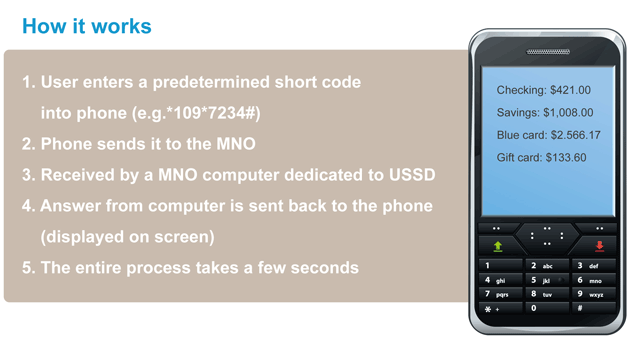
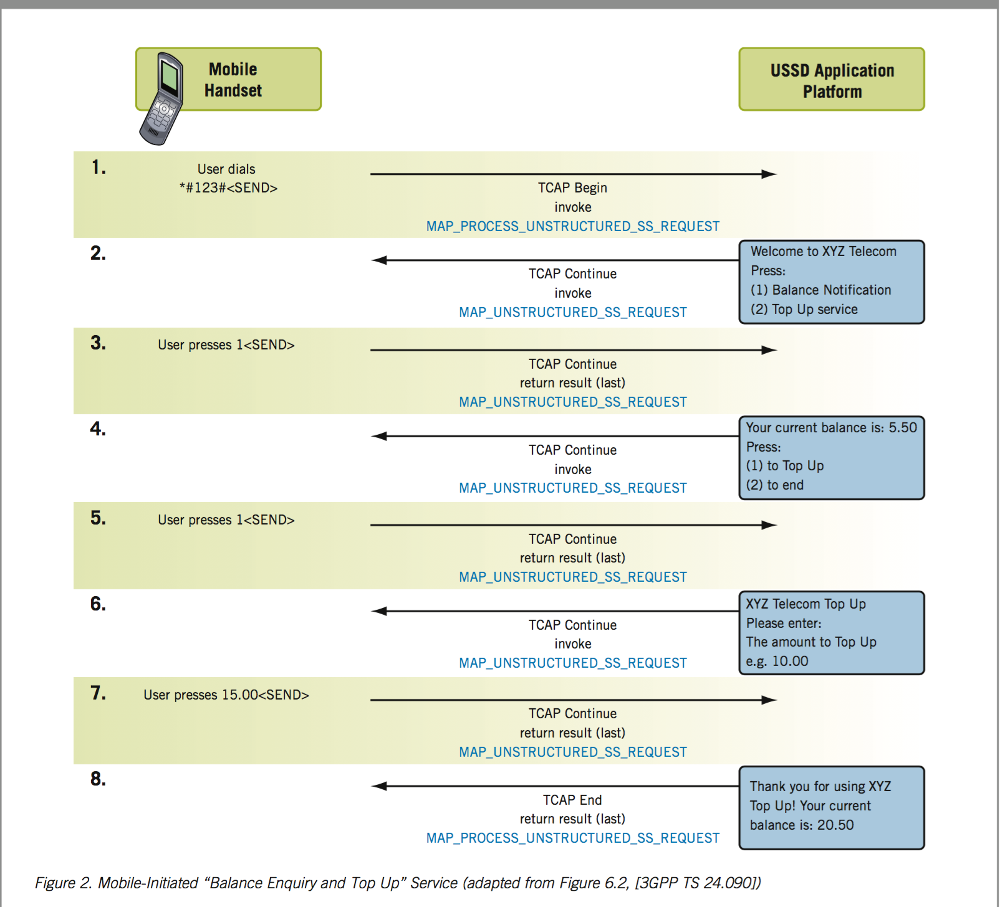

==============
How ussd works
==============

Unstructured Supplementary Service Data (USSD) is a protocol used by GSM cellphones to
communicate with their service provider's computers.
USSD can be used for WAP browsing, prepaid callback service,
mobile money services, location-based content services,
menu-based information services, or even as part of configuring the phone on the network.

.. image:: ./img/how_ussd_works.jpg

From the diagram above, a request is sent from a mobile phone to a telecom network
such Vodafone.

The Ussd Gateway (telecom) then sends the request to your ussd application
(i.e where we have the business logic which determines the menu to serve the use on
receiving user’s request.)

Your ussd application then responds to the request, and Ussd gateway goes ahead and
displays you content to the user

Below is a another diagram to help understand the concept

================
Why Ussd Airflow
================

Before I explain why we need Ussd Airflow lets
first look at one example of ussd user case

Example Menu-Driven USSD Application
-------------------------------------
One could decide to develop a mobile-initiated “Balance Enquiry and
Top Up” application using USSD signaling, enabling a mobile user to
interact with an application via the user’s handset, in order to
view his/her current mobile account balance and top up as needed.

An example of such an application could be as follows:

#. A mobile user initiates the “Balance Enquiry and Top Up” service by dialing the USSD string defined by the service provider; for example, *#123#.

#. TheUSSD application receives the service request from the user and responds by sending the user a menu of options.

#. The user responds by selecting a “current balance” option.

#. The USSD application sends back details of the mobile user’s current account balance and also gives the option to top up the balance.

#. The user selects to top up his/her account.

#. The application responds by asking how much credit to add?

#. The mobile user responds with the amount to add.

#. The USSD application responds by sending an updated balance and ends the session.

The figure below shows an example of the MAP/TCAP
message sequence required to realize the data transfers between
a mobile user’s handset and the USSD application to implement the
“Balance Enquiry and Top Up” service described above.

How ussd airflow comes in
--------------------------
As you have seen in the previous section your ussd application is responsible for the content
displayed.

Suppose you want to change the wordings in the ussd screen you are displaying
to the user,what is involved in most cases or rather all cases is you
make a change in your code and deploy, that's peanuts for most developers

The problem is once you start having many ussd screens and multiple ussd application
and many requirements of changing ussd screen,
the task that was peanuts becomes overwhelming and would probably start thinking
of a way the Product owners would change the ussd content without you being involved
and thats where **ussd aiflow** comes in, providing an interface for users to change
ussd workflows without code change

